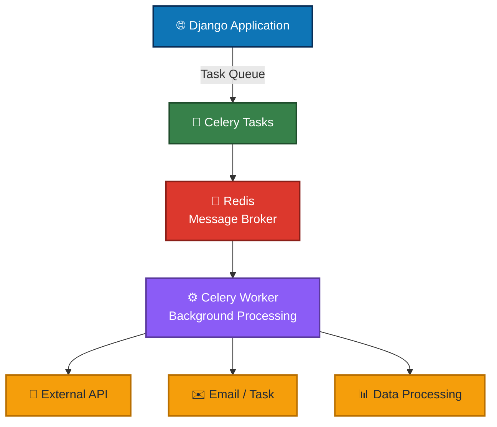
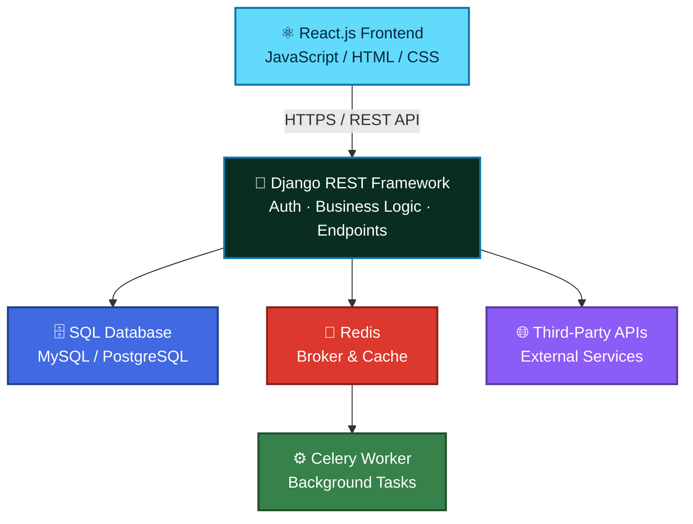

<div align="center">


<a href="https://git.io/typing-svg">
  
</a>

<br/>


<a href="https://github.com/Jebarlin7890?tab=followers"></a>
<a href="https://github.com/Jebarlin7890?tab=repositories"></a>

</div>

---

## 👨‍💻 About Me

> [!TIP]
> I'm a **Python Full Stack Developer** focused on developing modern, scalable and API-driven web applications — turning business requirements into clean, production-ready systems.

<table>
<tr>
<td width="55%" valign="top">

**🎯 What I Bring**

- 🐍 Building backend applications with **Python, Django and Django REST Framework**
- ⚛️ Developing interactive frontend applications with **React.js and JavaScript**
- 🔗 Designing and integrating **REST APIs** for frontend and backend communication
- ⚡ Implementing asynchronous and background processing with **Celery**
- 🔴 Working with **Redis** as a message broker and caching layer
- 🗄️ Working with **SQL, MySQL and PostgreSQL**
- ☁️ Deploying applications and backend services using **Microsoft Azure**
- 🌐 Working with domains, subdomains and production environments
- 🔄 Integrating third-party APIs and business workflows
- 🧪 Testing and debugging APIs using **Postman**
- 🛠️ Managing source code and development workflows with **Git and GitHub**
- 🎯 Focused on clean architecture, performance and maintainable code

</td>
<td width="45%" valign="top">

**📋 Quick Profile**

```yaml
name: Jebarlin
role: Python Full Stack Developer
focus:
  backend:  [Python, Django, DRF]
  frontend: [React.js, JS, HTML5, CSS3]
  async:    [Celery, Redis]
  database: [SQL, MySQL, PostgreSQL]
  cloud:    [Azure, Linux, Docker]
  tools:    [Git, GitHub, VS Code]
principles:
  - Clean architecture
  - Performance
  - Maintainable code
```

</td>
</tr>
</table>

<div align="center">


</div>

---

## 🛠️ Tech Stack

<div align="center">

### 💻 Languages

<br/>


<br/><br/>
<sub><strong>Responsive UI • Component-Based Development • API Integration • State Management</strong></sub>

<br/><br/>

### ⚙️ Backend

<br/>


<br/><br/>
<sub><strong>Authentication • Authorization • API Integration • Background Processing</strong></sub>

<br/><br/>

### ⚛️ Frontend

<br/>


<br/><br/>
<sub><strong>React.js • JavaScript • Bootstrap • Responsive UI</strong></sub>

<br/><br/>

### 🗄️ Database

<br/>


<br/><br/>
<sub><strong>SQL • MySQL • PostgreSQL • Django ORM</strong></sub>

<br/><br/>

### ☁️ Cloud & Deployment

<br/>


<br/><br/>
<sub><strong>Microsoft Azure • Linux • Docker • Production Deployment</strong></sub>

<br/><br/>

### 🧰 Tools

<br/>


<br/><br/>
<sub>  <strong>Version Control • API Testing • Development Environment • Collaboration</strong></sub>

<br/><br/>

</div>

---

## 🚀 What I Do

<div align="center">

| Area | Technologies |
|:---:|:---:|
| 🐍 Backend Development | Python, Django, Django REST Framework |
| 🔗 API Development | REST APIs, Authentication, API Integration |
| ⚡ Background Processing | Celery, Redis |
| ⚛️ Frontend Development | React.js, JavaScript, HTML5, CSS3 |
| 🗄️ Database | SQL, MySQL, PostgreSQL, Django ORM |
| ☁️ Cloud & Deployment | Microsoft Azure, Linux, Docker |
| 🛠️ Development Tools | Git, GitHub, VS Code, Postman |

</div>

---

## 🔌 API & Backend Development

I develop **API-driven backend systems** using Django and Django REST Framework, with a focus on clean architecture, reliable communication and maintainable business logic.

### Backend Capabilities

- 🔐 Authentication and authorization
- 🔗 RESTful API development
- 📡 Frontend ↔ Backend communication
- 📦 Third-party API integration
- 🧪 API testing and debugging
- 📄 Serialization and validation
- 🗄️ Database-driven business logic
- ⚙️ Workflow and service implementation
- 🚀 Production API deployment

---

## ⚡ Asynchronous Task Processing

I use **Celery with Redis** to handle operations that should run independently from the main web request.

<div align="center">



</div>

---

## 🏗️ Full Stack Architecture

My full-stack applications typically follow a separated frontend, API backend, asynchronous processing and database architecture.

<div align="center">



</div>

---

## 📊 GitHub Stats

<div align="center">

<table>
<tr>
<td align="center" width="25%">


</td>
<td align="center" width="25%">


</td>
<td align="center" width="25%">


</td>
<td align="center" width="25%">


</td>
</tr>
</table>

<br/>


<a href="https://github.com/Jebarlin7890"></a>

</div>

> [!NOTE]
> This dashboard uses shields.io badges pulling live data straight from the GitHub API, so it always renders — no dependency on third-party SVG-card generators (`github-readme-stats`, `streak-stats`, etc.), which were failing to load consistently. If you'd still like the fuller graphic stat cards (streak ring, top-languages chart, contribution graph) added back in later, the safest way is self-hosting your own instance of [`github-readme-stats`](https://github.com/anuraghazra/github-readme-stats#deploy-on-your-own) on Vercel — that removes the shared-server rate-limiting that's been causing the broken icons.

---

<div align="center">

## 📫 Let's Connect

<a href="https://github.com/Jebarlin7890"></a>

<br/><br/>


</div>
