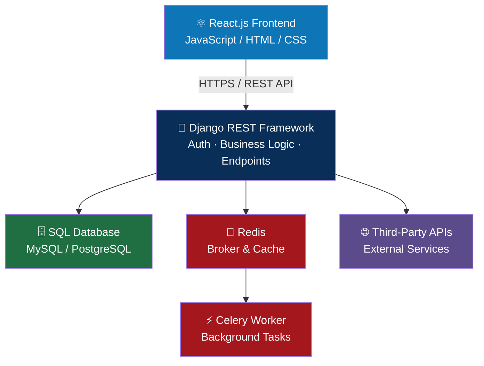

<div align="center">


<a href="https://git.io/typing-svg">
  
</a>

<br/>


<a href="https://github.com/Jebarlin7890?tab=followers"></a>
<a href="https://github.com/Jebarlin7890?tab=repositories"></a>

</div>

<br/>

## 👨‍💻 About Me

I'm a **Python Full Stack Developer** focused on building modern, scalable, API-driven web applications.

```yaml
name: Jebarlin
role: Python Full Stack Developer
focus:
  backend:  [Python, Django, Django REST Framework]
  frontend: [React.js, JavaScript, HTML5, CSS3, Bootstrap]
  async:    [Celery, Redis]
  database: [SQL, MySQL, PostgreSQL, Django ORM]
  cloud:    [Microsoft Azure, Linux, Docker]
  tools:    [Git, GitHub, VS Code, Postman]
principles: ["Clean architecture", "Performance", "Maintainable code"]
```

- 🔗 Designing and integrating **REST APIs** end to end
- ⚡ Async & background processing with **Celery + Redis**
- ☁️ Deploying and running services on **Microsoft Azure**
- 🔄 Integrating third-party APIs into real business workflows
- 🧪 Testing and debugging APIs with **Postman**

<br/>

## 🛠️ Tech Stack

<div align="center">

### Languages


### Backend

<br/><sub><strong>Django • DRF • Redis • Celery • REST APIs • Auth</strong></sub>

### Frontend

<br/><sub><strong>React.js • JavaScript • Bootstrap • Responsive UI</strong></sub>

### Database

<br/><sub><strong>SQL • MySQL • PostgreSQL • Django ORM</strong></sub>

### Cloud & DevOps

<br/><sub><strong>Microsoft Azure • Linux • Docker</strong></sub>

### Tools


</div>

<br/>

## 🚀 What I Do

<div align="center">

| Area | Technologies |
|:---|:---|
| 🐍 **Backend Development** | Python, Django, Django REST Framework |
| 🔗 **API Development** | REST APIs, Authentication, Integration |
| ⚡ **Background Processing** | Celery, Redis |
| ⚛️ **Frontend Development** | React.js, JavaScript, HTML5, CSS3 |
| 🗄️ **Database** | SQL, MySQL, PostgreSQL, Django ORM |
| ☁️ **Cloud & Deployment** | Microsoft Azure, Linux, Docker |
| 🛠️ **Dev Tools** | Git, GitHub, VS Code, Postman |

</div>

<br/>

## 🏗️ Full Stack Architecture

<div align="center">



</div>

<br/>

## 🔌 API & Backend Development

I build **API-driven backend systems** with Django and Django REST Framework, focused on clean architecture, reliable communication, and maintainable business logic.

<table>
<tr>
<td width="50%" valign="top">

**Core Capabilities**
- 🔐 Authentication & authorization
- 🔗 RESTful API development
- 📡 Frontend ↔ Backend communication
- 📦 Third-party API integration

</td>
<td width="50%" valign="top">

**Reliability & Delivery**
- 🧪 API testing and debugging
- 📄 Serialization and validation
- ⚙️ Workflow & service implementation
- 🚀 Production API deployment

</td>
</tr>
</table>

<br/>

## 📊 GitHub Stats

<div align="center">


</div>

<br/>

<div align="center">

## 📫 Let's Connect

<a href="https://github.com/Jebarlin7890"></a>

<br/><br/>


</div>
